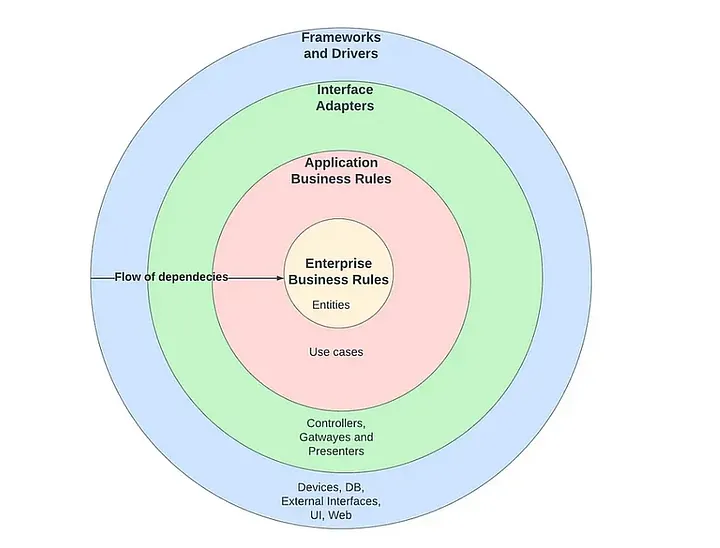
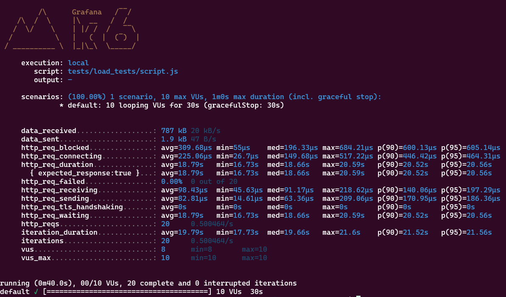

# Star wars microservice

This microservice get Star Wars character data from the SWAPI, sorts the characters by name, and provides a /sorted-people endpoint to access the sorted data.


## Architecture

The microservice follows the clean architecture guidelines.



Here you can see a detailed explaination of each folder and how it aligns with a specific layer of the architecture.
<ul>
<li>domain: Core business entities and rules (Entities Layer).
<li>use_cases: Application-specific business logic (Use Cases Layer).
<li>interfaces:  Adapters for communication between layers (Interface Adapters Layer).
    <ul>
        <li>controllers: Handles HTTP requests.
        <li>repositories: Abstracts data access.
        <li>serializers: Transforms data for presentation.
    </ul>
<li>infrastructure: External systems and frameworks (Frameworks and Drivers Layer).
    <ul>
        <li>api: Web server setup and routes.
        <li>external_services: Communication with external APIs.
    </ul>
</ul>

## Runing the microservice localy
```
pip install -r requirements.txt
python -m src.infrastructure.api.server
```
Go to http://127.0.0.1:5000/sorted-people to access the endpoint. You should see the logs (INFO) on the terminal.

## Running the microservice in the docker container
```
docker build -t star-wars-microservice
docker run -p 5000:5000 star-wars-microservice
```

Go to http://127.0.0.1:5000/sorted-people to access the endpoint. You should see the logs (INFO) on the terminal.

## Deploy the service to a kubernetes cluster (minikube)
```
minikube start
```

```
docker build -t star-wars-microservice .
kubectl apply -f k8s/star_wars_deployment.yaml
kubectl apply -f k8s/star_wars_service.yaml
minikube service star-wars-microservice-service
```

```
minikube stop
```

Click on the link shown on the URL column and add /sorted-people at the end of the route in the browser.

## Run load-testing script

Tool used: K6

K6 installation: https://grafana.com/docs/k6/latest/set-up/install-k6/

This script create 10 virtual users which make a get request to the endpoint exposed by our microservice every 1 sencond for 30 seconds.

```
k6 run tests/load_tests/script.js 
```


### How to read the results

We simply need to understand what are the definitions of each field. Once we know how each field is described we can look at the information to understand how our microservice is reactiong and what needs to improve.

#### Field defination
<ul>
<li>data_received               -> Number of bytes received from the microservice</li>
<li>data_sent                   -> Number of bytes sent to the microservice</li>
<li>http_req_blocked            -> Time spent blocked (waiting for a free TCP connection slot) before initiating request</li>
<li>http_req_connecting         -> Time spent establishing TCP connection to remote host</li>
<li>http_req_duration           -> Total time for the request. It's equal to http_req_sending + http_req_waiting + http_req_receiving</li>
<li>{ expected_response:true }  -> Response time for successful requets</li>
<li>http_req_failed             -> Percentage of requests failed during the test</li>
<li>http_req_receiving          -> Time spent by the server to process and fully respond to k6</li>
<li>http_req_sending            -> Time it took to send data to the target host</li>
<li>http_req_tls_handshaking    -> Time spend on TLS handshake</li>
<li>http_req_waiting            -> Time it took for the server to start the respond (First byte to arrive from the server to K6)</li>
<li>http_reqs                   -> Total requests send by K6 to the server and request per second executed by the test</li>
<li>iteration_duration          -> Avarage time it takes K6 to complete a single loop of a virtual user</li>
<li>iterations                  -> Number of iterations made by K6</li>
<li>vus                         -> Actives Virtual users when K6 tests finish</li>
<li>vus_max                     -> Maximun number of virtual users allowed at once for the test</li>
</ul>

#### Conclusion

The metric http_req_duration tells us the total time a request took to be completed. The average time for a request in our case is 18.79s

If we combine this information with the http_req_waiting we can see the 99% of the time was spend waiting for the server to respond. 

We can also obtain the number of bytes the server send per request (data_recived/iterations) which is 39.35 KB.

In this case we should try to improve the server response time. Since the response is always the same, we could add a system that checks if there is new information on the external service (SWAPI). If not, the server will return the already process response. If there is new data, we would proceed with the normal flow of the code.